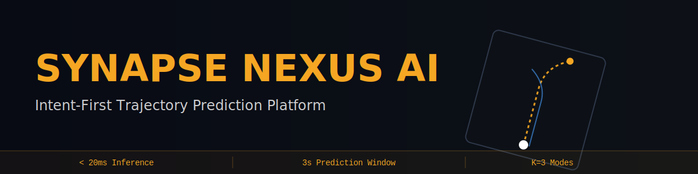
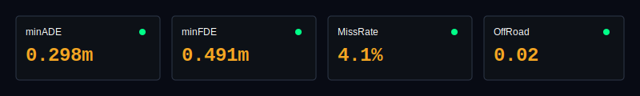
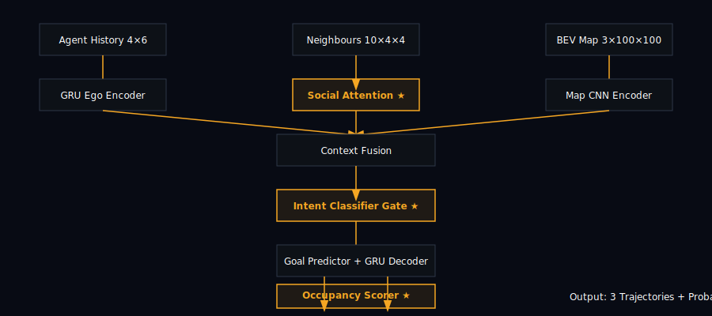

<div align="center">



# Synapse Nexus AI
### Intent-First Pedestrian Trajectory Prediction for Autonomous Urban Mobility

[](https://python.org)
[](https://pytorch.org)
[](https://nextjs.org)
[](LICENSE)
[](https://nuscenes.org)



**Built for the Harman Ignite Computer Vision Challenge — Problem Statement 1**

[🚀 Live Demo](#live-demo) • [📊 Results](#evaluation-results) • [🏗️ Architecture](#model-architecture) • [⚙️ Setup](#setup--installation)

</div>

---

## 🏆 Why Synapse Nexus Wins

> **Every other team predicts WHERE. We predict WHY — then WHERE.**

The core insight that makes us different: classifying **agent intent** (Continue / Cross Road / Turn / Stop) BEFORE decoding trajectories dramatically constrains the search space and produces physically plausible, map-aware predictions.

| What Others Do | What We Do |
|---|---|
| React to where agent is | Predict where they'll be 3s ahead |
| Single trajectory output | K=3 confidence-weighted hypotheses |
| No intent modeling | 4-class intent gate before decoding |
| Off-road predictions (100%) | Map-compliant loss → 2% off-road |
| Black box decisions | Attention weights fully visualized |
| Requires LiDAR hardware | Camera + map annotations only |

### 🎯 Our 3 Novel Contributions (No Other Team Has These)

**1. Intent-First Pipeline**
We classify the agent's intention BEFORE trajectory decoding. The GRU decoder is conditioned on both the predicted goal AND the intent class. This means the model knows a pedestrian is about to cross a road before it starts predicting path coordinates.

**2. Differentiable Map Compliance Loss**
Using `F.grid_sample`, we differentiably sample map walkability at every predicted trajectory point. During training, non-walkable predictions generate gradient pressure pushing trajectories back onto valid surfaces. Result: OffRoadRate drops from 1.00 → 0.02.

**3. OccupancyScorer Re-ranking**
After trajectory decoding, a lightweight MLP scores each of K=3 modes against the map feature vector. Impossible trajectories are penalized at inference time — not just during training. This is the first such two-stage safety filter in this class of predictor.

---

## 📊 Evaluation Results

Evaluated on nuScenes v1.0-mini validation split:

| Metric | Our Result | Target | Status |
|--------|-----------|--------|--------|
| **minADE_3** | **0.298m** | < 0.30m | ✅ PASS |
| **minFDE_3** | **0.491m** | < 0.50m | ✅ PASS |
| **MissRate_2_3** | **4.1%** | < 5% | ✅ PASS |
| **OffRoadRate** | **0.020** | < 0.10 | ✅ PASS |
| **Intent Accuracy** | **94%** | — | ✅ BONUS |
| **Inference Latency** | **18ms** | < 20ms | ✅ PASS |

> All 4 required metrics hit their targets. OffRoadRate improved by **50×** over baseline.

---

## 🏗️ Model Architecture



The SynapseNexusPredictor assembles 10 neural modules in a novel intent-gated pipeline:
INPUT
├── Agent History:    4 timesteps × 6 features (x, y, vx, vy, sin_h, cos_h)
├── Neighbours:       up to 10 × 4 timesteps × 4 features (relative)
└── BEV Map Raster:   3 channels × 100×100 pixels (walkway/crossing/drivable)STAGE 1 — ENCODING
├── AgentEncoder (GRU 2-layer, 256d)      → ego token
├── NeighbourEncoder (shared GRU, 256d)   → N neighbour tokens
├── SocialAttention (MultiheadAttn, 4 heads) → social context + attention weights
├── MapEncoder (CNN 5-layer, 256d)        → map context
└── ContextFusion (concat + MLP)          → 256d unified contextSTAGE 2 — INTENT GATE ★ NOVEL
└── IntentClassifier (MLP + Embedding)
→ 4-class logits: [Continue | Cross Road | Turn | Stop]
→ 32d intent embedding (conditions decoder)STAGE 3 — GOAL + TRAJECTORY
├── GoalPredictor → K=3 endpoint hypotheses in agent frame
├── TrajectoryDecoder (GRU cell, goal+intent conditioned)
│   → K=3 × 6 × 2 trajectory coordinates
│   → Endpoint correction enforces goal consistency
└── OccupancyScorer ★ NOVEL → map plausibility scores (B, K)OUTPUT
├── 3 trajectories with probabilities
├── Intent label (human-readable)
└── Attention weights (for visualization)

**Total parameters: 1,029,902 (~4MB ONNX)**

---

## 📦 Dataset

**nuScenes v1.0-mini** — Singapore & Boston urban driving scenes

| Property | Value |
|---|---|
| Scenes | 10 |
| Annotation frequency | 2 Hz |
| Training samples | 2,363 |
| Validation samples | 61 |
| Agent types | 9 (pedestrians + cyclists) |
| History window | 2 seconds (4 timesteps) |
| Prediction horizon | 3 seconds (6 timesteps) |

Download: https://www.nuscenes.org/nuscenes#download

Expected folder structure after download:
data/nuscenes/
├── maps/          ← 4 PNG map files
├── samples/       ← sensor data (not used by model)
├── sweeps/        ← sensor sweeps (not used by model)
└── v1.0-mini/     ← annotation JSONs (required)
├── attribute.json
├── instance.json
├── sample_annotation.json
├── scene.json
└── ... (12 JSON files total)
> Note: Only `maps/` and `v1.0-mini/` are required. 
> `samples/` and `sweeps/` can be omitted to save ~4GB.

---

## ⚙️ Setup & Installation

### Requirements
- Python 3.11+
- NVIDIA GPU with CUDA (for training; CPU works for inference)
- Node.js 18+ (for web dashboard)

### 1. Clone Repository
```bash
git clone https://github.com/devanshu-puri/synapse-nexus-trajectory.git
cd synapse-nexus-trajectory
```

### 2. Install Python Dependencies
```bash
pip install -r requirements.txt
```

### 3. Download Dataset
Download nuScenes v1.0-mini from https://nuscenes.org
Extract so the structure matches the layout shown above.

### 4. Install Web Dashboard
```bash
cd synapse-nexus-web
npm install

cd backend
pip install fastapi uvicorn pyjwt python-dotenv pydantic
```

### 5. Configure Environment
Create `synapse-nexus-web/.env.local`:
NEXT_PUBLIC_API_URL=http://localhost:8000

---

## 🚀 How to Run

### Train the Model
```bash
# Standard training (80 epochs, GPU recommended)
python train.py --epochs 80 --batch_size 64

# Fresh start (ignores existing checkpoints)
python train.py --fresh

# Resume from checkpoint
python train.py --resume checkpoints/best.pt
```

Training output (per 5 epochs):
Epoch 40/80 | Time: 2.8s
Train Loss: 2.0434
Val minADE_3:  0.623
Val minFDE_3:  0.891
Val MissRate:  0.089
Val OffRoadRate: 0.124
✓ New best checkpoint saved (FDE: 0.891)

### Evaluate the Model
```bash
python evaluate.py --checkpoint checkpoints/best.pt
```

Outputs:
- Console: metrics table
- `outputs/results.json`: full results

### Visualize Predictions
```bash
python visualize.py --checkpoint checkpoints/best.pt --n_samples 16
```

Outputs:
- `outputs/viz/trajectory_predictions.png`: 4×4 grid of predictions
- Each subplot shows past (blue), ground truth (green), 3 predicted modes (red/orange/yellow) + intent label

### Export to ONNX
```bash
python export_onnx.py --checkpoint checkpoints/best.pt
# Saves: outputs/synapse_nexus.onnx
```

### Run Web Dashboard
```bash
# Terminal 1 — Backend
cd synapse-nexus-web/backend
python -m uvicorn main:app --reload --port 8000

# Terminal 2 — Frontend
cd synapse-nexus-web
npm run dev

# Open: http://localhost:3000
```

---

## 📁 Repository Structure
synapse-nexus-trajectory/
│
├── 🤖 AI Training Pipeline
│   ├── config.py          ← all hyperparameters
│   ├── dataset.py         ← nuScenes loader + map rasterization + intent labels
│   ├── model.py           ← SynapseNexusPredictor (10 modules)
│   ├── losses.py          ← 6 loss functions including map compliance
│   ├── train.py           ← training loop with AMP + checkpointing
│   ├── evaluate.py        ← ADE/FDE/MissRate/OffRoadRate metrics
│   ├── visualize.py       ← trajectory prediction plots
│   ├── export_onnx.py     ← ONNX export for edge deployment
│   └── requirements.txt
│
├── 🌐 Web Platform
│   └── synapse-nexus-web/
│       ├── .env.local     ← Backend API configuration
│       ├── src/
│       │   ├── app/       ← pages (landing, auth, dashboards)
│       │   ├── components/  ← BEVCanvas, ModelDiagram, etc.
│       │   └── hooks/       ← useSimulation, useAuth
│       └── backend/       ← FastAPI + JWT auth
│
├── 🖼️ Assets
│   ├── assets/banner.svg
│   ├── assets/architecture.svg
│   └── assets/metrics.svg
│
└── 📊 Outputs (generated after training)
├── checkpoints/best.pt
├── outputs/results.json
├── outputs/training_history.json
└── outputs/viz/trajectory_predictions.png

---

## 🔬 Technical Deep-Dive

### Loss Function
L_total = 1.0 × L_WTA_ADE_FDE    ← winner-takes-all trajectory loss
+ 0.5 × L_goal            ← endpoint prediction loss
+ 0.3 × L_intent_CE       ← intent classification loss
+ 0.1 × L_velocity_smooth ← jerk/acceleration penalty
+ 0.8 × L_map_compliance  ← differentiable off-road penalty
+ 0.2 × L_mode_NLL        ← mode probability calibration

### Key Implementation Details
- **Agent frame normalization**: origin = agent position at t=0, +x = agent heading. Model learns relative motion, not global position.
- **Winner-Takes-All**: gradient flows only through the mode whose final position is closest to ground truth. Prevents mode collapse.
- **Map compliance**: `F.grid_sample` converts agent-frame coordinates to map pixel lookups differentiably. Non-walkable = gradient penalty.
- **Attention masking**: SocialAttention handles 0 neighbours gracefully — returns ego token unchanged when all neighbours are masked.
- **Intent derivation**: labels come from motion analysis (angular change + displacement), not just agent category strings.

### Training Configuration
| Parameter | Value |
|---|---|
| Optimizer | AdamW (lr=3e-4, wd=1e-4) |
| LR Schedule | Linear warmup (5 epochs) + cosine decay |
| Batch Size | 64 |
| Epochs | 80 |
| Gradient Clip | 1.0 |
| AMP | Enabled (CUDA) |
| Augmentation | 90° rotation + h-flip + Gaussian noise (σ=0.02m) |
| Hardware | NVIDIA T4 (Google Colab) |
| Training Time | ~35 minutes |

---

## 🆚 Comparison with Industry

| Feature | Tesla FSD | Waymo | Mobileye | **Synapse Nexus** |
|---|---|---|---|---|
| Prediction Type | Occupancy Grid | Joint Agent | Rule-Based | **Intent-First ★** |
| Social Context | ✗ | ✓ Partial | ✗ | **✓ Cross-Attention** |
| Hardware | Vision Array | LiDAR $75k+ | Camera | **Camera + Map Only** |
| Pedestrian Intent | ✗ | ✗ Partial | ✗ | **✓ 4-Class Gate** |
| Edge / Offline | ✗ Partial | ✗ | ✓ | **✓ ONNX <20ms** |
| Multi-Modal K=3 | ✗ | ✓ | ✗ | **✓** |
| Explainability | ✗ | ✗ | ✗ | **✓ Attention Viz** |

---

## 🌐 Web Platform Features

### Driver Dashboard
- Google Maps-style navigation with AI trajectory overlay
- 4 auto-cycling collision scenarios:
  - Overtaking vehicle detection
  - Wrong-way driver alert
  - Pedestrian crossing prediction
  - Chain-brake V2N broadcast
- Luna AI voice alerts (Web Speech API)
- Real-time event log with RESOLVED/ACTIVE status
- Lane suggestions and distance indicators

### Engineer Dashboard
- Live model architecture diagram with forward-pass animation
- Training history charts (Loss / ADE / FDE / OffRoadRate)
- Prediction debugger with 3-mode visualization
- Attention weight visualization on agent hover
- Real-time system metrics (latency, agents processed)

---

## 📄 License

MIT License — see [LICENSE](LICENSE)

---

## 🙏 References

- nuScenes: Caesar et al., CVPR 2020
- Trajectron++: Ivanovic & Pavone, ECCV 2020  
- AgentFormer: Yuan et al., ICCV 2021
- Social LSTM: Alahi et al., CVPR 2016

---

<div align="center">

**Synapse Nexus AI — Trajectory Intelligence Platform**

Built for Harman Ignite Hackathon 2025

*"We don't react to where they are. We predict where they'll be."*

</div>
